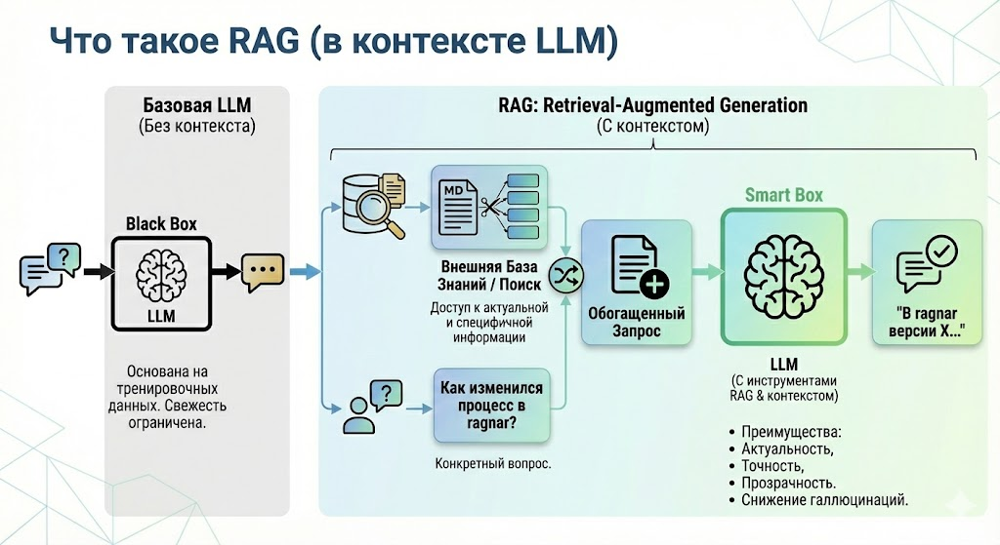
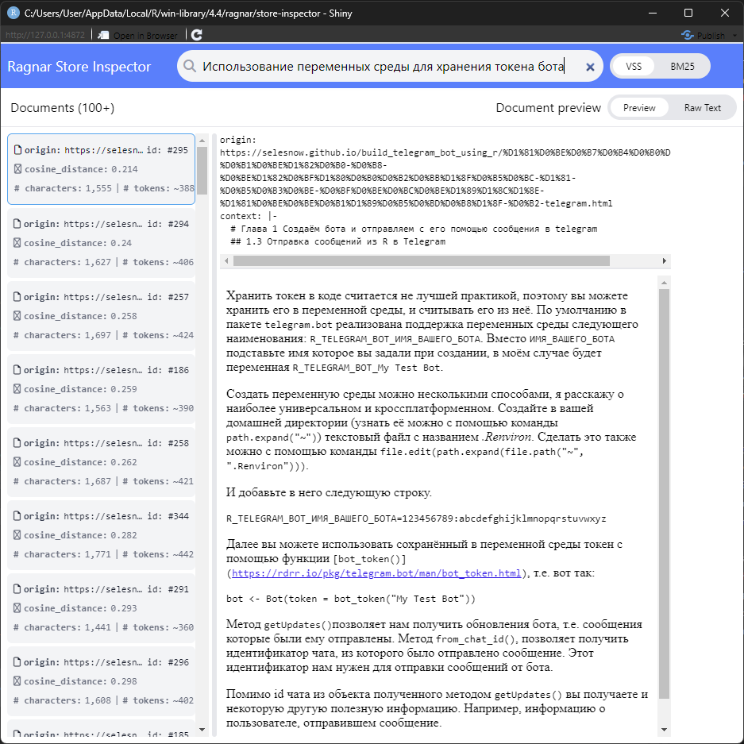

# RAG: Подключаем LLM модель к собственной базе знаний
В предыдущей главе мы научили нашего ассистента пользоваться внешними инструментами через MCP. Но что делать, если задача требует не выполнения функции, а глубокого знания специфической документации? Надеяться на общую эрудицию LLM опасно — она может "галлюцинировать" или просто не знать о существовании ваших внутренних регламентов и свежих учебников.

В этой главе мы освоим технологию RAG (Retrieval-Augmented Generation). Мы создадим собственную базу знаний на основе учебника по Telegram-ботам, научим систему превращать текст в математические векторы и сохранять их в высокопроизводительное хранилище DuckDB. В итоге мы получим экспертную систему, которая отвечает на вопросы строго по вашим документам, предоставляя ссылки на первоисточники

## Видео
<iframe width="560" height="315" src="https://www.youtube.com/embed/n60u8931mX4?enablejsapi=1" title="YouTube video player" frameborder="0" allow="accelerometer; autoplay; clipboard-write; encrypted-media; gyroscope; picture-in-picture; web-share" referrerpolicy="strict-origin-when-cross-origin" allowfullscreen></iframe>

### Тайм коды
* [**00:00**](https://youtu.be/n60u8931mX4?t=0) — О чём это видео
* [**01:54**](https://youtu.be/n60u8931mX4?t=114) — Концепция RAG: теория и применение
* [**06:02**](https://youtu.be/n60u8931mX4?t=362) — Настройка переменных среды для API ключей
* [**07:31**](https://youtu.be/n60u8931mX4?t=451) — Подготовка и загрузка документов (пакет `ragnar`)
* [**10:44**](https://youtu.be/n60u8931mX4?t=644) — Чанкинг, эмбеддинг и запись в векторное хранилище
* [**22:24**](https://youtu.be/n60u8931mX4?t=1344) — Обзор инструмента Ragnar Store Inspector
* [**24:05**](https://youtu.be/n60u8931mX4?t=1445) — Гибридный поиск: сравнение VSS и BM25
* [**31:13**](https://youtu.be/n60u8931mX4?t=1873) — Подключение LLM к базе знаний (Retrieval Tool)
* [**35:08**](https://youtu.be/n60u8931mX4?t=2108) — Разработка UI интерфейса в `shinychat`
* [**38:55**](https://youtu.be/n60u8931mX4?t=2335) — Резюме пройденного материала
* [**41:22**](https://youtu.be/n60u8931mX4?t=2482) — Заключение

## Презентация
<iframe src="https://www.slideshare.net/slideshow/embed_code/key/Fvl0Mk0bwKxp0q?hostedIn=slideshare&page=upload" width="476" height="400" frameborder="0" marginwidth="0" marginheight="0" scrolling="no"></iframe>

## Конспект
### Что такое RAG простыми словами
Если обычная LLM (например, Gemini или ChatGPT) — это очень умный студент, который прочитал весь интернет, но ничего не знает о ваших личных файлах, то RAG — это тот же студент, которому разрешили пользоваться библиотекой ваших документов во время экзамена.

Вместо того чтобы пытаться запихнуть всю документацию вашей компании в системный промпт (где место ограничено и это стоит дорого), мы учим модель:

* Сначала найти нужные куски текста в базе данных.
* Затем прочитать их и на их основе составить ответ.



### Обзор рабочего процесса RAG
В этом уроке мы с вами будем разбираться с пакетом `ragnar`, о котором ранее в этом курсе ещё не упоминалось. `ragnar` имеет в арсенале весь необходимый функционал для реализации RAG подхода. 


Рабочий процесс построения RAG:

1. **Обработка документов**, это первый этап на котором вам необходимо привести ваши документы к пригодному для дальнейшей работы формату. В `ragnar` для этого есть 2 функции:

* `read_as_markdown()` - Читает документы: pdf, power point, word, excel, zip, youtube видео и другие, и приводит их к markdown разметке.
* `ragnar_find_links()` - Ищет все ссылки на заданной веб-странице, для удобной подготовки любого сайта как будущей базы данных.

2. **Разбивка документов на фрагменты**, этот этап реализуется функцией `markdown_chunk()`, которая является полнофункциональным инструментом для разделения текста на фрагменты.

3. **Расширение контекста фрагментов**, опциональный шаг, позволяющий добавить в каждый фрагмент текста дополнительный контекст, например заголовки. Реализуется функцией `markdown_chunk()`.

4. **Эмбединг**, процесс векторного кодирования каждого отдельного фрагмента текста, реализуется семейством функций `embed_*()`.

5. **Хранение базы знаний**, зашифрованные фрагменты текста необходимо записать в хранилище, для этого есть несколько функций:

* `ragnar_store_create()` - создание хранилище, по умолчанию используется DuckDB
* `ragnar_store_connect()` - подключение к хранилищу
* `ragnar_store_insert()` - запись данных в хранилище

6. **Поиск и извлечение релевантных фрагментов**, для этого этапа в `ragnar` также имеется семейство функций:

* `ragnar_retrieve()` - высокоуровневая функция, которая совмещает в себе vss и bm25 поиск, а так же обработку полученных результатов.
* `ragnar_retrieve_vss()` - реализует vss поиск по базе знаний.
* `ragnar_retrieve_bm25()` - реализует полнотекстовый поиск по базе знаний.
* `chunks_deoverlap()` - объединяет полученные поиском фрагменты учитывая то, что они могут перекрывать друг друга.

7. **Подключаем чат к базе знаний**, финальный этап, на котором мы подключаем базу знаний к чату с помощью функции `ragnar_register_tool_retrieve(chat, store)`.

Далее каждый шаг разберём более подробно на реальном примере.

### Обработка документов: фрагментирование, эмбединг и запись в хранилище
В качестве базы знаний я буду использовать свой учебник по [разработке telegram ботов](https://selesnow.github.io/build_telegram_bot_using_r/). Для начала нам необходимо получить ссылки на все главы учебника:

```{r eval=FALSE}
library(ragnar)
library(tidyverse)
library(ellmer)

# 1. Создание базы знаний -------------------------------------------------

# задаём URL документации
base_url <- "https://selesnow.github.io/build_telegram_bot_using_r/"

# считываем все ссылки исключая не нужные
pages <- ragnar_find_links(base_url) %>% 
         .[stringr::str_detect(., 'https://selesnow.github.io/build_telegram_bot_using_r')]
```

### Разбивка документов на фрагменты
На этом этапе у нас есть вектор из URL на каждую главу учебника, который будет использоваться в качестве базы данных. Теперь каждую главу отдельно необходимо обработать, и разбить её дополнительно на фрагменты, но перед этим отвлечёмся немного от нашего реального примера, и рассмотрим примеры использования аргументов функции `markdown_chunk()`.

**Аргументы:**
* `md` - MarkdownDocument, или текст в Markdown разметке.
* `target_size` - Целевой размер фрагмента в символах. По умолчанию: 1600 (приблизительно 400 токенов или 1 страница текста). Фактический размер блока может отличаться от целевого значения до 2 * `max_snap_dist.` Если установлено значение `NULL`, `NA` или `Inf` используется с `segment_by_heading_levels`, размер блока неограничен, и каждый блок соответствует сегменту.
* `target_overlap` - Числовое значение в [0, 1). Доля желаемого перекрытия между последовательными фрагментами. 
* `max_snap_dist` - Максимальное расстояние (в символах), на которое может переместиться точка разреза, чтобы достичь семантической границы. 
* `segment_by_heading_levels` - Целочисленный вектор с возможными значениями 1:6. Заголовки на этих уровнях рассматриваются как границы сегментов; разбиение на фрагменты выполняется независимо для каждого сегмента.
* `context` - Добавить столбец context, содержащий заголовки Markdown, находящиеся в области видимости, в начале каждого фрагмента кода.
* `text` - Если значение равно TRUE, включить textстолбец с содержимым фрагмента. 

Что бы лучше понять работу каждого отдельного аргумента можно обратиться к примерам из справки:

```{r eval=FALSE}
library(ragnar)

md <- "
# Title

## Section 1

Some text that is long enough to be chunked.

A second paragraph to make the text even longer.

## Section 2

More text here.

### Section 2.1

Some text under a level three heading.

#### Section 2.1.1

Some text under a level four heading.

## Section 3

Even more text here.
"

markdown_chunk(md, target_size = 40)
markdown_chunk(md, target_size = 40, target_overlap = 0)
markdown_chunk(md, target_size = NA, segment_by_heading_levels = c(1, 2))
markdown_chunk(md, target_size = 40, max_snap_dist = 100)
```

Теперь вернёмся к нашему примеру, у нас есть вектор с ссылкой на каждую главу учебника по разработке teelgram ботов, наша задача - разбить по очереди каждую главу учебника на фрагменты, векторизировать каждый фрагмент и записать в хранилище. 

При создании хранилища с помощью `ragnar_store_create()` вам сразу необходимо передать в аргумент `embed` функцию реализующую эмбединг. Эмбеддинг (embedding) - это числовой вектор, который как можно компактнее и осмысленно кодирует смысл фрагмента текста (слова/предложения/параграфа/страницы). В RAG он превращает текст в пространство, где «похожесть смыслов» измеряется расстоянием между векторами — и на этом строится извлечение релевантных фрагментов. На данный момент в `ragnar` довольно большой набор функций для эмбединга:

* embed_azure_openai()
* embed_bedrock()
* embed_databricks()
* embed_google_gemini()
* embed_google_vertex()
* embed_lm_studio()
* embed_ollama()
* embed_openai()
* embed_snowflake()

Все облачные модели требуют передачи API ключа, для тестов, как я говорил в первой главе, вы можете использовать бесплатный ключ к Gemini API, более подробно об этом я рассказывал в разделе [Генерация API ключа для работы с LLM], единственная разница в том, что авторы `ragnar` используют своё название переменной среды для хранения API ключа, вместо `GOOGLE_API_KEY` вам необходимо передать ваш API ключ в переменную `GEMINI_API_KEY`.

```{r eval=FALSE}
# задём путь хранилища
store_location <- "tgbot_rag.duckdb"

# создаём хранилище
store <- ragnar_store_create(
  store_location,
  embed = \(x) ragnar::embed_google_gemini(x)
)
```

После создания хранилища в цикле мы собираем обрабатываем каждую главу учебника, разбиваем на фрагменты, и записываем в хранилище, при записи в хранилище автоматически применяется эмбединг, т.к. функцию для эмбединга мы задали на прошлом шаге при создании хранилища.

```{r eval=FALSE}
# разбиваем каждую отдельную страницу на чанки
# и записываем в хранилище
for (page in pages) {
  message("ingesting: ", page)
  chunks <- page |> read_as_markdown() |> markdown_chunk()
  ragnar_store_insert(store, chunks)
}
```

Далее, что бы корректно работал поиск по базе знаний необходимо построить индекс с помощью `ragnar_store_build_index()`.

```{r eval=FALSE}
# строим индекс для поиска
ragnar_store_build_index(store)
```

Каждый раз при добавлении новой информации в базу знаний индекс необходимо перестраивать.

В `ragnar` отдельно встроен функционал Ragnar Store Inspector, запустить его можно с помощью `ragnar_store_inspect(store)`. С его помощью вы можете выполнять через графический интерфейс поиск по вашему хранилищу, это поможет вам определиться с тем, успешно вы разбили ваш исходный документ на чанки, или нет. 



Вы задаёте запрос, далее все фрагменты в правой части интерфейса сортируются по релевантности в порядке убывания, т.е. наиболее релевантный вашему запросу чанк должен быть самым первым. Если вы получается фрагменты релевантные запросу значит вы достаточно качествено выполнили разделения документов на фрагменты, в противном случае вам стоит вернуться к разделу [Обработка документов: фрагментирование, эмбединг и запись в хранилище], и переосмыслить фрагментирования (чанкинга), поигравшись с аргументами функции `markdown_chunk()`.

>Совет: Используйте инспектор не только для проверки поиска, но и для отладки чанкинга. Если вы видите в результатах обрывки фраз или нечитаемые куски кода — значит, параметры target_size или max_snap_dist нужно подкорректировать.

### Поиск по хранилищу
Программно тоже можно осуществлять поиск по хранилищу: 

```{r eval=FALSE}
# 2. Обращение к базе знаний ----------------------------------------------

# подключение к базе знаний
store <- ragnar_store_connect(store_location, read_only = TRUE)

text <- "Можно ли хранить токен telegram бота в переменной среды?"

# запрос информации из базы знаний
relevant_chunks <- ragnar_retrieve(store, text)
```

В объекте `relevant_chunks` в результате будут хранится наиболее релевантные вашему запросу чанку, с дополнительным контекстом:

```
> relevant_chunks
# A tibble: 3 × 9
  origin                                                 doc_id chunk_id start   end cosine_distance bm25  context text 
  <chr>                                                   <int> <list>   <int> <int> <list>          <lis> <chr>   <chr>
1 https://selesnow.github.io/build_telegram_bot_using_r…     10 <int>    23266 24775 <dbl [1]>       <dbl> "# Гла… "Дал…
2 https://selesnow.github.io/build_telegram_bot_using_r…     10 <int>    39143 40839 <dbl [1]>       <dbl> "# Гла… "###…
3 https://selesnow.github.io/build_telegram_bot_using_r…     12 <int>     4767  7211 <dbl [2]>       <dbl> "# Гла… "## …
```

Я уже писал выше, что `ragnar` совмещает два типа поиска:

* VSS - Поиск по смыслу. Ищем не совпадение слов, а близость смысла. Удобно, например, для поиска нужной функций по её описанию.
* BM25 - Поиск по ключевым словам. Ищем буквальное совпадение текста. Например, вы знаете точное название нужной функции, и хотите найти её описание.

### Создаём интерфейс чата
Итак, давайте ещё раз резумируем весь процесс создания хранилища с базой знаний, именно её мы далее будем использовать при создании интерфейса чата.

```{r eval=FALSE}
library(ragnar)
library(tidyverse)
library(ellmer)

# 1. Создание базы знаний -------------------------------------------------

# задаём URL документации
base_url <- "https://selesnow.github.io/build_telegram_bot_using_r/"

# считываем все ссылки исключая не нужные
pages <- ragnar_find_links(base_url) %>% 
         .[stringr::str_detect(., 'https://selesnow.github.io/build_telegram_bot_using_r')]

# задём путь хранилища
store_location <- "tgbot_rag.duckdb"

# создаём хранилище
store <- ragnar_store_create(
  store_location,
  embed = \(x) ragnar::embed_google_gemini(x)
)

# разбиваем каждую отдельную страницу на чанки
# и записываем в хранилище
for (page in pages) {
  message("ingesting: ", page)
  chunks <- page |> read_as_markdown() |> markdown_chunk()
  ragnar_store_insert(store, chunks)
}

# строим индекс для поиска
ragnar_store_build_index(store)

# инструмент проверки хранилища
ragnar_store_inspect(store)
```

Подготовка хранилища выполняется один раз, далее вы можете дополнять базу знаний, но не забывайте что при каждом изменении надо повторно строить индекс.

Далее, с помощью пакета `shinychat`, знакомого нам по нескольким прошлым главам мы можем создать графический интерфейс для чата.

```{r eval=FALSE}
library(shiny)
library(shinychat)

ui <- bslib::page_fillable(
  chat_ui(
    id = "chat",
    messages = "**Привет!** я помогаю в разработке telegram ботов на языке R. Чем могу тебе помочь?"
  ),
  fillable_mobile = TRUE
)

server <- function(input, output, session) {
  
  # подключаем базу знаний к ellmer чату
  chat <- ellmer::chat_google_gemini(
    system_prompt =  stringr::str_squish(
      "Ты помощник по разработке telegram ботов на языке R. 
       Для формирования каждого ответа сначала ищи информацию в своей базе знаний используя инструмент get_data_from_knowledge_store, 
       т.е. предупреждай, что начинаешь поиск по базе знаний, используй инструмент get_data_from_knowledge_store и только потом отвечай 
       с учётом полученной из базы знаний информации, это обязательное условие для формирования ответов.
       Процитируй или перефразируй отрывки, четко отличая свои слова от слов источника. 
       Предоставь рабочую ссылку на каждый цитируемый источник, а также любые дополнительные соответствующие ссылки.
       Так же всегда добавляй в ответ дополнительный контекст чанков которые использовал для формирования самого ответа, заголовки частей из которых был получен используемый чанк в формате списка с ссылками, где текст бери из поля context используемого чанка, а сама ссылка поля origin используемого чанка.
       Т.е. в конце сообщения ты обязательно должен вывести информацию про используемые для ответа чанки из базы знаний.
       Если ты не смог найти ни один чанк в базе знаний то в ответе просто скажи, что по вашему запросу я не сумел найти ничего в своей базе знаний, т.е. сам никогда ничего не придумывай, это важно!
      "
    ),
    model = 'gemini-2.0-flash',  
    echo  = 'none'
  )
  
  # подключаемся к хранилищу с базой знаний
  store <- ragnar_store_connect("tgbot_rag.duckdb", read_only = TRUE)
  # добавляем модели инструмент поиска по базе знаний
  ragnar_register_tool_retrieve(chat, store, top_k = 10, name = 'get_data_from_knowledge_store', title = 'knowledge_store')
  
  observeEvent(input$chat_user_input, {
    stream <- chat$stream_async(input$chat_user_input)
    chat_append("chat", stream)
  })
}

shinyApp(ui, server)
```

Подключение модели к базе знаний реализуется там же где и инициализация чата, т.е. в серверной части приложения, там же вы добавляете в объект `chat` инструмент `get_data_from_knowledge_store`, позволяющей модели осуществлять поиск по вашей базе знаний.


Т.к. я в системном промпте прописал инструкции о том, что модель в конце ответа обязательно должна предоставить фрагменты базы знаний, которые были использованы при формировании ответа, то в конце ответа мы видим следующее:


## Заключение
Вы прошли путь от создания простого чат-бота до построения сложной экспертной системы на языке R. Теперь ваш ассистент не просто владеет инструментами, но и обладает «памятью», основанной на ваших документах. Мы объединили возможности Telegram, MCP и векторных баз данных в единую экосистему.

В предыдущих модулях мы уже использовали пакет `shinychat` для создания интерфейса, но задействовали лишь его базовые возможности «из коробки». Однако, чтобы создать по-настоящему профессиональное приложение, недостаточно просто вывести окно чата. Нужно уметь управлять темами оформления, предлагать пользователю подсказки и, что самое важное, делать работу инструментов прозрачной и наглядной.

В следующем уроке мы перейдем к глубокой кастомизации интерфейса. Мы разберем, как превратить базовый чат в продуманный продукт: научимся менять визуальный стиль, внедрять интерактивные подсказки и настраивать отображение работы инструментов так, чтобы пользователь понимал каждое действие ассистента.

## Вопросы для самопроверки

1. <details>
    <summary>**Почему для реализации RAG-подхода недостаточно просто скопировать весь текст учебника в системный промпт?**</summary>
    У каждой модели есть ограничение на размер контекстного окна. Кроме того, передача огромных массивов текста в каждом запросе сильно замедляет работу и делает каждый вопрос пользователя очень дорогим. RAG позволяет передавать только те 3-5 фрагментов, которые действительно нужны для ответа.
   </details>

2. <details>
    <summary>**В чем разница между поиском VSS и поиском BM25, которые комбинирует функция `ragnar_retrieve()`?**</summary>
    VSS (Vector Semantic Search) ищет похожие по смыслу фрагменты, даже если слова не совпадают. BM25 — это классический полнотекстовый поиск, который находит точные вхождения слов. Их комбинация (гибридный поиск) обеспечивает максимальную точность.
   </details>

3. <details>
    <summary>**Зачем нужно устанавливать `target_overlap` (перекрытие) при разбиении текста на чанки?**</summary>
    Перекрытие гарантирует, что важный контекст не будет "разрезан" пополам. Если предложение начинается в одном чанке и заканчивается в другом, модель сможет понять смысл фрагмента целиком, имея доступ к контексту из соседнего чанка.
   </details>

4. <details>
    <summary>**Почему после добавления новых документов в хранилище обязательно нужно вызывать `ragnar_store_build_index()`?**</summary>
    Индекс — это специальная структура данных, которая позволяет искать похожие векторы за миллисекунды. Без перестроения индекса новые данные будут лежать в таблице, но поисковые алгоритмы не смогут их найти.
   </details>

5. <details>
    <summary>**Как системный промпт защищает от "галлюцинаций" модели при работе с базой знаний?**</summary>
    С помощью инструкции «если ты не смог найти информацию в базе знаний — так и скажи». Это запрещает модели использовать свои общие знания из интернета и заставляет её опираться только на предоставленные факты.
   </details>
