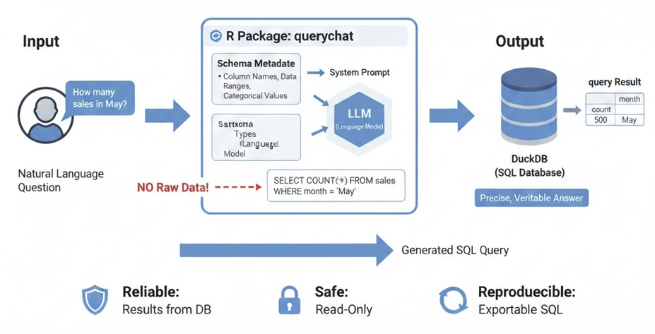
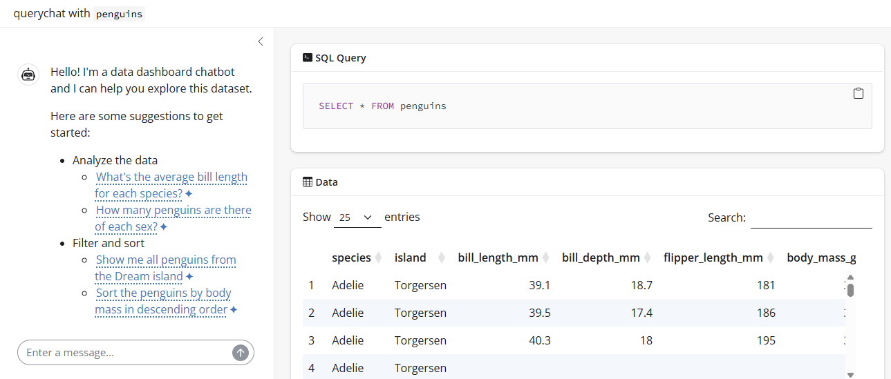

# Shiny интерфейс для манипуляции данными на естественном языке (пакет querychat)

В предыдущих уроках мы научились создавать чат-интерфейсы и кастомизировать их внешний вид. Однако часто перед аналитиком встает задача не просто «поговорить» с моделью, а дать пользователю инструмент для исследования данных.

Представьте ситуацию: у вас есть дашборд с финансовыми показателями, и руководитель хочет не настраивать фильтры вручную, а просто написать: «Покажи продажи по региону Север за прошлый квартал».

Именно для таких задач создан пакет `querychat`. Он позволяет превратить любой датафрейм или базу данных в интерактивный диалог, где пользователь задает вопросы на естественном языке, а система автоматически генерирует SQL-запросы, фильтрует данные и обновляет визуализации.

## Видео
<iframe width="560" height="315" src="https://www.youtube.com/embed/pS4pKPWB9VI?enablejsapi=1" title="YouTube video player" frameborder="0" allow="accelerometer; autoplay; clipboard-write; encrypted-media; gyroscope; picture-in-picture; web-share" referrerpolicy="strict-origin-when-cross-origin" allowfullscreen></iframe>

### Тайм-коды
* [**00:00**](https://youtu.be/pS4pKPWB9VI?t=0) — Введение
* [**01:36**](https://youtu.be/pS4pKPWB9VI?t=96) — Демонстрация интерфейса построенного на основе пакета querychat
* [**04:27**](https://youtu.be/pS4pKPWB9VI?t=267) — Как работает querychat
* [**06:06**](https://youtu.be/pS4pKPWB9VI?t=366) — Создание и запуск интерфейса с помощью querychat
* [**09:50**](https://youtu.be/pS4pKPWB9VI?t=590) — Подключение внешних источников данных
* [**10:53**](https://youtu.be/pS4pKPWB9VI?t=653) — Предоставление дополнительного контекста
* [**18:22**](https://youtu.be/pS4pKPWB9VI?t=1102) — Интеграция querychat в свои Shiny приложения
* [**27:28**](https://youtu.be/pS4pKPWB9VI?t=1648) — Инструменты в querychat
* [**30:16**](https://youtu.be/pS4pKPWB9VI?t=1816) — Заключение

## Презентация
<iframe src="https://www.slideshare.net/slideshow/embed_code/key/IBzP2Q97C4q8Gi?hostedIn=slideshare&page=upload" width="476" height="400" frameborder="0" marginwidth="0" marginheight="0" scrolling="no"></iframe>

## Конспект

### Назначение пакета querychat

**querychat** — это вспомогательный R-пакет, предназначенный для создания интерактивных интерфейсов, которые позволяют пользователю общаться с данными на естественном языке.

Основное предназначение пакета — упростить интеграцию больших языковых моделей (LLM) с табличными данными и базами данных в среде Shiny. В отличие от стандартных чат-интерфейсов, `querychat` фокусируется на задачах **Text-to-SQL** и **Text-to-R**, позволяя:

* **Автоматизировать написание запросов:** Пакет берет на себя формирование промптов, описывающих структуру ваших таблиц (схемы данных), чтобы модель могла генерировать точный код для выборки и фильтрации.
* **Бесшовно интегрироваться с Shiny:** Предоставляет готовые UI и серверные модули для быстрого развертывания аналитических ассистентов.
* **Работать с различными источниками:** Поддерживает как локальные `data.frame`, так и внешние базы данных, обеспечивая безопасную передачу контекста данных модели.
* **Визуализировать процесс:** Позволяет не только получать финальный ответ, но и отображать сгенерированный код, что критически важно для верификации результатов аналитиком.

### Как это работает

`querychat` использует возможности больших языковых моделей (LLM) для перевода естественного языка в SQL-запросы. Модели любого масштаба — от небольших локальных до мощных флагманских решений от ведущих провайдеров — показывают отличные результаты в этой задаче. Однако даже лучшим моделям необходимо понимать структуру ваших данных для корректной работы.

Для решения этой задачи `querychat` включает метаданные схемы — названия столбцов, типы данных, диапазоны значений и категории — в системный промпт модели.

**Важно:** `querychat` **не отправляет** ваши необработанные данные в LLM. Модель получает только структурную информацию, достаточную для генерации точного запроса. Когда модель выдает SQL-код, `querychat` выполняет его в базе данных (по умолчанию используется DuckDB) для получения точных результатов.



Такая архитектура делает `querychat` надежным, безопасным и воспроизводимым инструментом:

* **Надежность:** Результаты запросов приходят из реальной базы данных, а не из сгенерированных моделью саммари. Это гарантирует точность и проверяемость данных, а также снижает риск «галлюцинаций».
* **Безопасность:** Инструменты `querychat` по умолчанию работают только в режиме чтения (read-only), что исключает риск случайного удаления или изменения ваших данных.
* **Воспроизводимость:** Сгенерированный SQL-код можно экспортировать и запустить в любой другой среде, поэтому ваш анализ не привязан к одному инструменту.

### Быстрое создание и запуск интерфейса для манипуляции данных на естественном языке

В пакете `querychat` присутствует функция `querychat_app()`, в которую достаточно передать `data.frame`, название провайдера и LLM модели, и она соберёт базовый интерфейс для работы с переданной таблицей на естественном языке.

```{r eval=FALSE}
library(querychat)
library(palmerpenguins)

# Наиболее простой способ запуска приложения
querychat_app(
  penguins, 
  client = "google_gemini/2.5-flash", 
  greeting = "Привет" # сгенерировать приветствие можно методом qc$generate_greeting(echo = 'all')
)
```



Для более гибкой настройки объекта `ellmer::Chat`, который создаётся под капотом `querychat_app()` (например, для добавления в чат дополнительных инструментов или подключения MCP сервера), вы можете передать в `querychat_app()` уже инициализированный объект `ellmer::Chat`.

```{r eval=FALSE}
# Запуск с кастомизированным объектом чата
# инициализируем объект чата
chat <- ellmer::chat_google_gemini()
# запускаем минимальное приложение
qc <- querychat(penguins, client = chat)
# запуск
qc$app()
```

### Подключение внешних источников данных

Помимо `data.frame`, в качестве входных данных вы можете передавать созданное через `DBI` интерфейс подключение к любой базе данных, и далее указать таблицу, которую хотите вывести в интерфейсе `querychat`.

Ниже пример подключения к MySQL:

```{r eval=FALSE}
library(DBI)
library(RMariaDB)
library(querychat)

# Connect to MySQL
con <- dbConnect(
  RMariaDB::MariaDB(),
  host = "localhost",
  port = 3306,
  dbname = "mydatabase",
  user = "myuser",
  password = "mypassword"
)

qc <- querychat(con, "my_table")
qc$app()  # Launch the app

# Don't forget to disconnect when done
# dbDisconnect(con)
```

### Предоставление дополнительного контекста

При создании интерфейса `querychat` сам генерирует системный промпт для переданного в интерфейс объекта `ellmer::Chat`, но вы можете:

* Добавить собственные инструкции (аргумент `extra_instructions`);
* Добавить подробное описание данных (аргумент `data_description`);
* Использовать собственный шаблон для генерации системного промпта (аргумент `prompt_template`).

```{r eval=FALSE}
library(querychat)
library(palmerpenguins)

# инициализируем объект чата
chat <- ellmer::chat_google_gemini()
# запускаем минимальное приложение
qc <- querychat(penguins, client = chat)
# просмотр системного промпта
cat(qc$system_prompt)

# Добавление описания данных
qc <- querychat(
  penguins,
  client = chat,
  data_description = "data_description.md"
)

cat(qc$system_prompt)

# Добавляем расширенные инструкции
instructions <- "
- Отвечай всегда на русском языке.
- Придерживайся темы и обсуждай только касающееся панели данных (дашборд).
- Отказывайся отвечать на вопросы, не относящиеся к теме.
"

qc <- querychat(
  penguins,
  client = chat,
  extra_instructions = instructions
)

cat(qc$system_prompt)

# Используем пользовательский шаблон
qc <- querychat(
  penguins,
  client = chat,
  data_description = "data_description.md",
  extra_instructions = instructions, 
  prompt_template = 'custom_prompt.md'
)

cat(qc$system_prompt)

qc$app()
```

Встроенный шаблон системного промпта можно найти с помощью команды `system.file('prompts', 'prompt.md', package = 'querychat')`.

Дефолтный системный промпт включает в себя:
* Базовый набор правил и рекомендаций, в том числе по использованию инструментов для выполнения запросов и обновления приложения.
* SQL-схему предоставленного вами фрейма данных:
  * Названия столбцов;
  * Типы данных;
  * Для текстовых столбцов, содержащих менее 10 уникальных значений (количество регулируется аргументом `categorical_threshold`), мы предполагаем, что это категориальные переменные, и включаем список значений;
  * Для столбцов с целыми и вещественными числами мы указываем диапазон.
* Описание данных (если предоставлено через `data_description`).
* Дополнительные инструкции, которые вы хотите использовать для управления поведением `querychat` (если они предоставлены через `extra_instructions`).

### Внедрение querychat в своё Shiny приложение

Вы можете не только строить готовый интерфейс через `querychat`, но и интегрировать его в свои приложения. Это имеет смысл, если ваше приложение отвечает следующим параметрам:

* Единый источник данных (или набор связанных таблиц, которые можно объединить).
* Множество фильтров, позволяющих пользователям анализировать и изучать данные различными способами.
* Несколько вариантов визуализации и вывода — все они зависят от одних и тех же отфильтрованных данных.

Шаги внедрения `querychat` в собственное Shiny приложение:

1. Инициализируйте экземпляр QueryChat, используя ваши данные.
2. Добавьте компонент пользовательского интерфейса (либо `$sidebar()`, либо `$ui()`).
3. Используйте реактивные значения, такие как `$df()`, `$sql()` и `$title()` для создания выходных данных, реагирующих на запросы пользователей.

```{r eval=FALSE}
library(shiny)
library(bslib)
library(querychat)
library(DT)
library(palmerpenguins)

# Step 1: инициализация QueryChat
chat <- ellmer::chat_google_gemini()
qc <- QueryChat$new(penguins, client = chat)

# Step 2: Добавление UI компонента
ui <- page_sidebar(
  sidebar = qc$sidebar(),
  card(
    card_header("Data Table"),
    dataTableOutput("table")
  ),
  card(
    fill = FALSE,
    card_header("SQL Query"),
    verbatimTextOutput("sql")
  )
)

# Step 3: Используем реактивные выражения в серверной логике
server <- function(input, output, session) {
  qc_vals <- qc$server()
  
  output$table <- renderDataTable({
    datatable(qc_vals$df(), fillContainer = TRUE)
  })
  
  output$sql <- renderText({
    qc_vals$sql() %||% "SELECT * FROM penguins"
  })
}

shinyApp(ui, server)
```

В серверной части вы используете следующие реактивные выражения, полученные методом `$server()`:

* Метод `$df()` возвращает текущий отфильтрованный и/или отсортированный фрейм данных. Он обновляется всякий раз, когда пользователь запрашивает операцию фильтрации или сортировки через интерфейс чата.
* Метод `$sql()` возвращает текущий SQL-запрос в виде строки. Это полезно для отображения запроса пользователям в целях прозрачности и воспроизводимости.
* Метод `$title()` возвращает краткое описание текущего фильтра, предоставленное LLM при генерации запроса. Например, если пользователь запрашивает «показать пингвинов Адели», заголовок может быть «пингвины Адели».

В серверной части все визуальные элементы, которые строятся на базе данных из реактивного выражения `$df`, автоматически реагируют на фильтрацию данных через чат и динамически изменяются.

```{r eval=FALSE}
library(shiny)
library(bslib)
library(querychat)
library(DT)
library(plotly)
library(palmerpenguins)

chat <- ellmer::chat_google_gemini()
qc <- QueryChat$new(penguins, client = chat)

ui <- page_sidebar(
  sidebar = qc$sidebar(),
  card(
    card_header("Data Table"),
    dataTableOutput("table")
  ),
  card(
    card_header("Body Mass by Species"),
    plotlyOutput("mass_plot")
  )
)

server <- function(input, output, session) {
  qc_vals <- qc$server()
  
  output$table <- renderDataTable({
    datatable(qc_vals$df(), fillContainer = TRUE)
  })
  
  output$mass_plot <- renderPlotly({
    ggplot(qc_vals$df(), aes(x = body_mass_g, fill = species)) +
      geom_density(alpha = 0.4) +
      theme_minimal()
  })
}

shinyApp(ui, server)
```

В примере выше мы привязали к реактивному выражению `qc_vals$df()` таблицу и график, и оба элемента меняются при взаимодействии пользователя с `querychat`.

Поскольку методы `$sql()` и `$title()` являются сеттерами, вы программным способом можете прокидывать в них значения. Таким образом, можно, например, повесить на кнопки вашего приложения действия сброса фильтров:

```{r eval=FALSE}
library(shiny)
library(bslib)
library(querychat)
library(DT)
library(palmerpenguins)

chat <- ellmer::chat_google_gemini()
qc <- QueryChat$new(penguins, client = chat)

ui <- page_sidebar(
  sidebar = sidebar(
    qc$ui(),
    hr(),
    actionButton("reset", "Reset Filters")
  ),
  # Main content
  card(dataTableOutput("table"))
)

server <- function(input, output, session) {
  qc_vals <- qc$server()
  
  output$table <- renderDataTable({
    qc_vals$df()
  })
  
  observeEvent(input$reset, {
    qc_vals$sql("")
    qc_vals$title(NULL)
  })
}

shinyApp(ui, server)
```

В данной статье описан `querychat` версии 0.2.0, в которой пока не реализована возможность одновременно подключить чат к нескольким таблицам. Для взаимодействия через чат с несколькими таблицами необходимо под каждую создать объект `QueryChat` и разнести их на разные вкладки:

```{r eval=FALSE}
library(shiny)
library(bslib)
library(palmerpenguins)
library(titanic)
library(querychat)

chat <- ellmer::chat_google_gemini()
qc_penguins <- QueryChat$new(penguins, client = chat)
qc_titanic <- QueryChat$new(titanic_train, client = chat)

ui <- page_navbar(
  title = "Multiple Datasets",
  sidebar = sidebar(
    id = "sidebar",
    conditionalPanel(
      "input.navbar == 'Penguins'",
      qc_penguins$ui()
    ),
    conditionalPanel(
      "input.navbar == 'Titanic'",
      qc_titanic$ui()
    )
  ),
  nav_panel(
    "Penguins",
    card(dataTableOutput("penguins_table"))
  ),
  nav_panel(
    "Titanic",
    card(dataTableOutput("titanic_table"))
  ),
  id = "navbar"
)

server <- function(input, output, session) {
  qc_penguins_vals <- qc_penguins$server()
  qc_titanic_vals <- qc_titanic$server()
  
  output$penguins_table <- renderDataTable({
    qc_penguins_vals$df()
  })
  
  output$titanic_table <- renderDataTable({
    qc_titanic_vals$df()
  })
}

shinyApp(ui, server)
```

В будущих версиях авторы обещают добавить возможность подключения нескольких таблиц к одному чату.

### Инструменты в querychat

При создании чата пакет `querychat` автоматически добавляет в `ellmer::Chat` несколько инструментов, с помощью которых модель преобразует естественный язык в SQL запросы, обновляет визуальные элементы или производит вычисления. Эти инструменты можно разделить на 2 группы:

* **Обновление данных** (`update_dashboard` и `reset_dashboard`) — фильтрация и сортировка данных (без отправки результатов в LLM).
* **Анализ данных** (`query`) — составление сводных отчетов и предоставление результатов.

## Заключение

Мы научились создавать интерфейсы, которые позволяют пользователям общаться с данными на естественном языке. `querychat` берет на себя самую сложную часть — перевод человеческой речи в SQL-запросы и безопасное исполнение их на данных, сохраняя при этом прозрачность процесса.

Однако работа аналитика редко ограничивается только выборкой данных. Часто нам нужно построить сложный пайплайн: сначала выгрузить данные, потом провести статистический тест, затем, если результат значим, сформировать отчет и отправить его коллегам. Один чат-бот с этим может не справиться.

Здесь на сцену выходят **мультиагентные системы**. В следующем уроке мы познакомимся с пакетом `mini007` и узнаем, как создать команду специализированных AI-агентов, которые могут взаимодействовать друг с другом для решения комплексных задач.

## Вопросы для самопроверки

1. <details>
    <summary>**Передает ли querychat исходные данные в LLM для генерации SQL запроса?**</summary>
    Нет, `querychat` передает в LLM только схему данных (названия столбцов, типы данных, категориальные значения), а сами данные остаются в безопасности. Модель возвращает SQL-код, который выполняется локально или в вашей базе данных.
   </details>

2. <details>
    <summary>**Какие три основных реактивных значения возвращает метод `$server()` в querychat?**</summary>
    Метод возвращает `$df()` (отфильтрованный датафрейм), `$sql()` (текущий SQL-запрос) и `$title()` (описание текущего фильтра на естественном языке).
   </details>

3. <details>
    <summary>**Можно ли подключить querychat к внешней базе данных, например MySQL или PostgreSQL?**</summary>
    Да, `querychat` поддерживает работу с любыми базами данных через интерфейс `DBI`. Вы можете передать объект подключения (connection) вместо локального датафрейма.
   </details>

4. <details>
    <summary>**Как можно кастомизировать поведение чата и добавить специфические правила?**</summary>
    Вы можете использовать аргументы `extra_instructions` (для дополнительных правил поведения), `data_description` (для описания бизнес-смысла данных) или полностью заменить системный промпт через `prompt_template`.
   </details>

5. <details>
    <summary>**Поддерживает ли текущая версия querychat одновременную работу с несколькими несвязанными таблицами в одном окне чата?**</summary>
    В версии 0.2.0 — нет. Для работы с разными таблицами необходимо создавать отдельные экземпляры `QueryChat` и размещать их, например, на разных вкладках приложения.
   </details>
