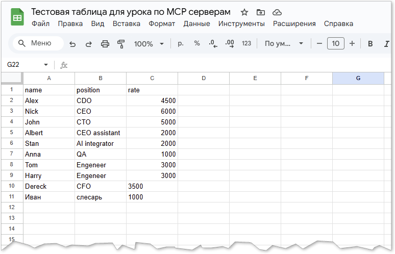
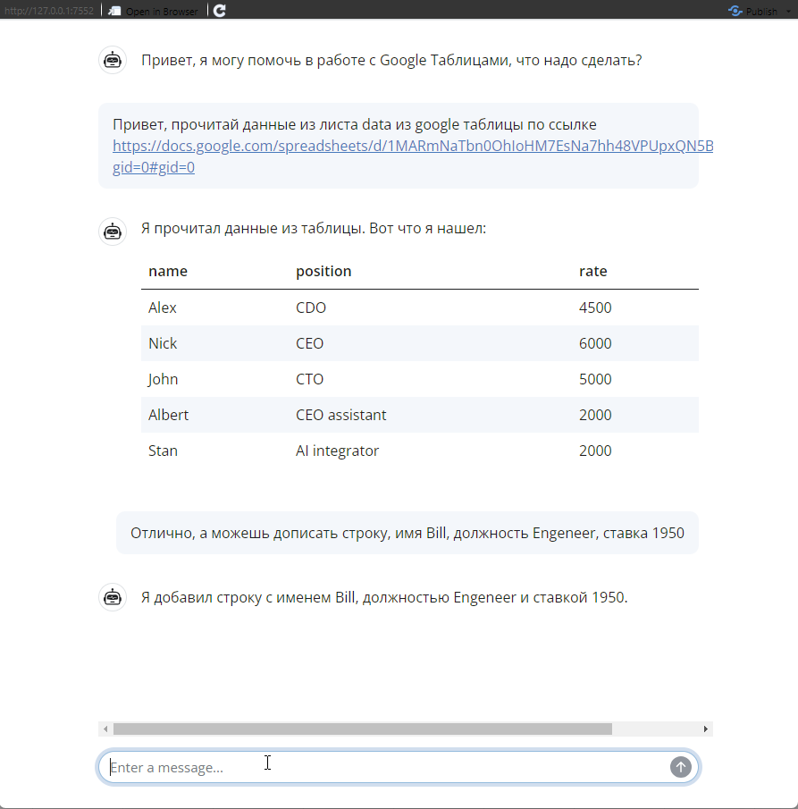

# Язык R как MCP сервер и MCP клиент
В предыдущих главах мы научили нашего бота говорить и помнить контекст. Но до сих пор он оставался лишь "советчиком", запертым внутри диалогового окна. Чтобы превратить ИИ в настоящего цифрового сотрудника, нам нужно дать ему доступ к нашим инструментам: базам данных, API и локальным скриптам.

В этой главе мы освоим Model Context Protocol (MCP) — открытый стандарт, который позволяет языковым моделям бесшовно подключаться к вашим R-функциям. Мы пройдем путь от написания своего MCP-сервера на языке R до подключения его к профессиональным инструментам вроде Claude Desktop. Вы увидите, как превратить обычную библиотеку для работы с Google Таблицами в мощный AI-инструмент, который выполняет ваши команды в реальном времени.

## Видео
<iframe width="560" height="315" src="https://www.youtube.com/embed/460ZySMbpuI?si=57sOVxW1XeB2vlz5" title="YouTube video player" frameborder="0" allow="accelerometer; autoplay; clipboard-write; encrypted-media; gyroscope; picture-in-picture; web-share" referrerpolicy="strict-origin-when-cross-origin" allowfullscreen></iframe>

### Тайм коды
* [**00:00**](https://youtu.be/460ZySMbpuI?t=0) — О чём это видео
* [**01:50**](https://youtu.be/460ZySMbpuI?t=110) — Что такое MCP сервер: концепция и протокол
* [**03:10**](https://youtu.be/460ZySMbpuI?t=190) — Пишем свой MCP сервер на языке R (пакет `mcptools`)
* [**13:03**](https://youtu.be/460ZySMbpuI?t=783) — Использование R в качестве MCP клиента
* [**20:24**](https://youtu.be/460ZySMbpuI?t=1224) — Подключение R-сервера к Claude Desktop
* [**23:10**](https://youtu.be/460ZySMbpuI?t=1390) — Работа с активными R сессиями через пакет `btw`
* [**27:09**](https://youtu.be/460ZySMbpuI?t=1629) — Заключение и итоги

## Презентация
<iframe src="https://www.slideshare.net/slideshow/embed_code/key/gOcodtotgJZmGV?hostedIn=slideshare&page=upload" width="476" height="400" frameborder="0" marginwidth="0" marginheight="0" scrolling="no"></iframe>

## Конспект
### Что такое MCP сервер
MCP-сервер — это сервис, который предоставляет языковым моделям (типа ChatGPT или Claude) доступ к функциям и данным на вашей стороне. Модель подключается к серверу через единый стандартный протокол и получает «инструменты»: функции, API-эндпоинты, доступ к файлам, базе данных, Google Sheets и т.д.

По сути: MCP-сервер = адаптер между вашим кодом и ИИ, который говорит с моделью на понятном ей стандартизированном языке.

Это способ научить ИИ пользоваться вашими функциями, но не через обычный function calling (как внутри одного запроса), а через универсальный сервер, к которому могут подключаться разные приложения — Claude, VSCode плагины, ellmer, ваш Shiny, боты и т.д.

### Язык R как MCP сервер
Используя пакет mcptools язык R может выполнять роль и MCP сервера, и MCP клиента.


MCP сервер на R должен состоять из следующих компонентов:

Функции на языке R;

* Аннотации к этим функциям, т.е. их описание;
* Скрипт должен возвращать список объектов, созданных с помощью `ellmer::tool()`.
* Ниже я приведу небольшой пример написанного на языке R MCP сервера для работы с Google Sheets API.

>Если вы ранее не работали с Google Sheets API на языке R то можете обратиться к статье ["Как работать с API Google Таблиц (Google Sheets API v4) на языке R с помощью нового пакета googlesheets4"](https://habr.com/ru/articles/488756/).


``` r
# gs-tools.R ----------------------------------------------
suppressPackageStartupMessages({
  library(ellmer)
  library(googlesheets4)
  library(tibble)
})


# Создание R функций

# 1) Создать демо‑таблицу ------------------------------------------------------
.gs_init_demo <- function(title = "MCP Demo Contacts") {
  .gs4_auth_once()
  df0 <- tibble(name = character(), email = character(), city = character())
  ss <- gs4_create(name = title, sheets = list(contacts = df0))
  # Вернём удобные поля для LLM
  meta <- gs4_get(ss)
  return(jsonlite::toJSON(
    list(
      spreadsheet_url = meta$spreadsheet_url,
      spreadsheet_id = as_sheets_id(ss)$spreadsheet_id,
      worksheet = "contacts"
    )
  )
  )
}

# 2) Прочитать верхние n строк -------------------------------------------------
.gs_read <- function(sheet, worksheet = "contacts", range = NULL, n_max = 5) {
  googlesheets4::gs4_auth(path = Sys.getenv("GOOGLE_SERVICE_ACCOUNT_JSON", unset = ""))
  res <- suppressMessages(googlesheets4::read_sheet(sheet, sheet = worksheet, range = range, n_max = n_max))
  return(jsonlite::toJSON(res, pretty = TRUE, auto_unbox = TRUE))
}

# 3) Добавить одну строку ------------------------------------------------------
.gs_append_contact <- function(sheet, worksheet = "data", name, position = NA, rate) {
  googlesheets4::gs4_auth(path = Sys.getenv("GOOGLE_SERVICE_ACCOUNT_JSON", unset = ""))
  df <- tibble(name = name, position = position, rate = rate)
  googlesheets4::sheet_append(ss = sheet, data = df, sheet = worksheet)
  return(jsonlite::toJSON(list(ok = TRUE, appended = nrow(df)), pretty = TRUE, auto_unbox = TRUE))
}

# 4) Прочитать метаданные таблицы ----------------------------------------------
.gs_info <- function(sheet) {
  googlesheets4::gs4_auth(path = Sys.getenv("GOOGLE_SERVICE_ACCOUNT_JSON", unset = ""))
  res <- suppressMessages(googlesheets4::gs4_get(sheet))
  return(jsonlite::toJSON(res, pretty = TRUE, auto_unbox = TRUE))
}


# 5) Проверка значений переменной среды ----------------------------------------
.gs_show_env <- function(env) {
  message("Переменная среды: ", Sys.getenv(env, unset = ""))
  return(jsonlite::toJSON(Sys.getenv(env, unset = ""), pretty = TRUE, auto_unbox = TRUE))
}

# Описания инструментов (ellmer 0.3.0) -----------------------------------------

Tool_gs_init <- tool(
  .gs_init_demo,
  name = "gs_init",
  description = "Create an empty Google Sheet with a 'contacts' worksheet (name, email, city). Returns spreadsheet metadata.",
  arguments = list(
    title = type_string("Spreadsheet title", required = FALSE)
  )
)

Tool_gs_read <- tool(
  .gs_read,
  name = "gs_read",
  description = "Read a small preview from a Google Sheet. Useful for head/preview, not full export.",
  arguments = list(
    sheet = type_string("Google Sheet URL or ID"),
    worksheet = type_string("Worksheet name", required = FALSE),
    range = type_string("A1 range like 'A1:D20'", required = FALSE),
    n_max = type_integer("How many rows to return", required = FALSE)
  )
)

Tool_gs_append_contact <- tool(
  .gs_append_contact,
  name = "gs_append_contact",
  description = "Append a single contact row (name, email, optional city) to the Google Sheet.",
  arguments = list(
    sheet = type_string("Google Sheet URL or ID"),
    worksheet = type_string("Worksheet name"),
    name      = type_string("Employee name"),
    position  = type_string("Employee job title", required = FALSE),
    rate      = type_string("Employee salary")
  )
)

Tool_gs_info <- tool(
  .gs_info,
  name = "gs_info",
  description = "Read a google sheet metadata info.",
  arguments = list(
    sheet = type_string("Google Sheet URL or ID")
  )
)

Tool_show_env <- tool(
  .gs_show_env,
  name = "gs_show_env",
  description = "Show environment variable for debug.",
  arguments = list(
    env = type_string("Environ variables name")
  )
)

msum <- function(x) sum(x)
Tool_sum <- tool(
  msum,
  name = "sum",
  description = "Sum of Vector Elements",
  arguments = list(
    x = type_array(type_integer())
  )
)

mmax <- function(x) max(x)
Tool_max <- tool(
  mmax,
  name = "max",
  description = "Max value of Vector Elements",
  arguments = list(
    x = type_array(type_integer())
  )
)

# MCP сервер должен вернуть список инструментов
list(
  Tool_sum,
  Tool_max,
  Tool_gs_init,
  Tool_gs_read,
  Tool_gs_append_contact,
  Tool_gs_info,
  Tool_show_env
)
```

Сохраняем код нашего MCP сервера в файл `gs-tools.R`.

Код этого MCP сервера, как я и писал выше, состоит из 3 блоков:

1. Создание R функций:
   <ol type="1" start="1">
     <li><code>.gs_init_demo()</code> - создание Google таблицы</li>
     <li><code>.gs_read()</code> - чтение google таблицы</li>
     <li><code>.gs_append_contact()</code> - добавить строку в google таблицу</li>
     <li><code>.gs_info()</code> - чтение метаданных google таблицы</li>
     <li><code>.gs_show_env()</code> - чтение переменной среды</li>
     <li><code>msum()</code> / <code>mmax()</code> - арифметические функции</li>
   </ol>

2. Описание функций:
   <ol type="1" start="1">
     <li><code>Tool_gs_init</code></li>
     <li><code>Tool_gs_read</code></li>
     <li><code>Tool_gs_append_contact</code></li>
     <li><code>Tool_gs_info</code></li>
     <li><code>Tool_show_env</code></li>
     <li><code>Tool_sum</code></li>
     <li><code>Tool_max</code></li>
   </ol>

3. Возвращает список инструментов

Есть несколько правил, которые необходимо помнить при написании своего MCP сервера:

* Все функции должны возвращать JSON объекты, поэтому у меня все возвращаемые объекты завёрнуты в `return(jsonlite::toJSON(obj, pretty = TRUE, auto_unbox = TRUE))`
* Если внутри функции вам необходимо использовать какие-то пакеты, то прописывайте полный путь к этой функции, т.е. `package::function()` а не просто `function()`.
* В конце скрипта должен возвращаться список созданных инструментов.

При описании своих функций с помощью `ellmer::tool()` вам необходимо передать следующие аргументы:

* Сам объект функции, которую описываете
* Дать её имя, которое будет использовать модель
* Задать подробное описание функции, именно по описание модель из контекста промпта будет понимать какую функцию ей необходимо вызвать.
* Отдельным списком дать описание каждого аргумента функции, для обозначения того, какого типа данные необходимо передавать в каждый из аргументов функции используйте семейство функций `ellmer::type_*()`, которые можно разделить на 3 категории:
    * **Скаляры** представляют собой отдельные значения, которые бывают пяти типов: `type_boolean()`, `type_integer()`, `type_number()`, `type_string()` и `type_enum()`, представляющие собой отдельные логические, целочисленные, двойные, строковые и факторные значения соответственно.
    * **Массивы** представляют любое количество значений одного типа и создаются с помощью type_array(). Вы всегда должны указывать item аргумент, который определяет тип каждого отдельного элемента. Массивы скаляров очень похожи на атомарные векторы R. Если необходимо передавать вектор какого то определённого типа, то необходимо использовать сочетание функций, например если аргумент требует передать целочисленный вектор то описать это можно так: `type_array(type_integer())`.
    * **Объекты** представляют собой набор именованных значений и создаются с помощью `type_object()`. Объекты могут содержать любое количество скаляров, массивов и других объектов. Они похожи на именованные списки в R.
    
Для того, чтобы подключить MCP сервер к какому либо клиенту, будь то `ellmer` или Claude Desktop, необходимо прописать его конфиг в виде json файла:


``` json
{
  "mcpServers": {
    "r-gsheets": {
      "command": "Rscript",
      "args": ["-e", "mcptools::mcp_server(tools='G:/GS_MCP/gs-tools.R')"],
      "env": {
        "GOOGLE_SERVICE_ACCOUNT_JSON": "G:/GS_MCP/service.json",
		"R_LIBS_USER": "C:/Users/User/AppData/Local/R/win-library/4.4"
      }
    }
  }
}
```

* `mcpServers` это объект верхнего уровня, каждый его дочерний элемент является отдельным подключенным MCP сервером.
* `r-gsheets` - заданное нами имя для MCP сервера, который мы написали.
* `command` - каждый MCP сервер запускает какую либо команду, в нашем случае MCP сервер запускается через утилиту Rscript.
* `args` - сюда мы передаём аргументы командной строки, в нашем случае для выполнения R кода прописывается `"-e"`, и далее сама команда запуска MCP сервера `"mcptools::mcp_server(tools='G:/GS_MCP/gs-tools.R')"`, т.е. мы запускаем MCP сервер, который считывает инструменты из созданного нами файла `gs-tools.R`.
* `env` - позволяет передать в MCP сервер переменные среды, в моём случае:
    * `GOOGLE_SERVICE_ACCOUNT_JSON` - передаю путь к ключу сервисного аккаунта Google, под которым проходит авторизация в Google Sheets.
    * `R_LIBS_USER` - отдельно передаю путь к моей пользовательской библиотеке пакетов, получить путь можно через `.libPaths()`. Если не задавать эту переменную то в моём случае MCP сервер на windows вообще не запускался, потому что не понимал откуда подгружать необходимые пакеты.
    
### R как MCP клиент
У нас уже есть код и конфиг нашего MCP сервера, теперь осталось разобраться с тем, как подключить его к объекту чата созданного с помощью `ellmer::chat_*()`.

В этом разделе мы будем работать с Google таблицами, я заранее создал [демо таблицу](https://docs.google.com/spreadsheets/d/1MARmNaTbn0OhIoHM7EsNa7hh48VPUpxQN5B1gGYFSD0/edit?gid=0#gid=0) и расшарил доступ на сервисный аккаунт, который использую в своём MCP клиенте.



Для подключения MCP сервера достаточно использовать метод `Chat$set_tools()`:


``` r
library(mcptools)
library(ellmer)

# Создаём объект чата
chat <- chat_google_gemini(system_prompt = 'Ты помощник по работе с google таблицами')

# Подключаем MCP сервер
chat$set_tools(mcp_tools(config = "G:\GS_MCP\gs-tools.json"))

# Используем инструменты из MCP сервера
chat$chat('Привет, скажи какой список инструментов у тебя есть?')

# Проверяем что переменные окружения успешно считались из конфига MCP сервера
chat$chat('Покажи мне значение переменной среды GOOGLE_SERVICE_ACCOUNT_JSON')

# Читаем Google таблицу
chat$chat("Посмотри какие метаданные есть в таблице 1MARmNaTbn0OhIoHM7EsNa7hh48VPUpxQN5B1gGYFSD0")
chat$chat("Теперь у той же таблицы с ключом 1MARmNaTbn0OhIoHM7EsNa7hh48VPUpxQN5B1gGYFSD0 прочитай данные с листа data, что там?")
chat$chat("Хорошо, а можешь теперь посчитать общую сумму зарплат из поля rate?")
chat$chat("У кого из сотрудников в таблице самая высокая зарплата?")

# Запись данных
chat$chat("А теперь запиши в эту же таблицу новую строку, имя Erik, должность CFO, оклад 4250")
```

Т.е. в этом примере мы:

1. Создаём объект чата с помощью `chat_google_gemini()`
2. Подключаем MCP сервер через `chat$set_tools(mcp_tools(config = "gs-tools.json"))`, указав путь к созданному ранее конфигу MCP сервера.

Далее модель из контекста вашего промпта понимает какие из инструментов MCP сервера ей использовать для выполнения действий.

### Заворачиваем AI ассистента в интерфейс чата
Что бы этот урок был максимально автономным ещё раз вспомним о пакете `shinychat` и обернём наш чат бот в веб интерфейс.


``` r
library(shiny)
library(shinychat)
library(mcptools)

ui <- bslib::page_fillable(
  chat_ui(
    id = "chat",
    messages = "Привет, я могу помочь в работе с Google Таблицами, что надо сделать?"
  ),
  fillable_mobile = TRUE
)

server <- function(input, output, session) {
  
  # Создаём объект чата
  chat <- ellmer::chat_google_gemini(
    system_prompt = 'Ты помощник по работе с google таблицами'
  )
  
  # Подключаем MCP сервер
  chat$set_tools(mcp_tools(config = r"(G:\GS_MCP\gs-tools.json)"))
  
  observeEvent(input$chat_user_input, {
    stream <- chat$stream_async(input$chat_user_input)
    chat_append("chat", stream)
  })
}

shinyApp(ui, server)
```

Теперь ваш AI ассистент будет иметь графический интерфейс, и уметь работать с Google Таблицами.



### Подключаем MCP сервер к Claude Desktop
Написанный на R MCP сервер можно подключать не только к `ellmer`, но и к другим клиентам, например Claude Desktop.

Для этого в Claude Desktop перейдите в `Settings` / `Developer` / `Edit config`, и добавьте созданный ранее JSON конфиг для подключения нашего MCP сервера.

После перезапуска Claude Desktop вы сможете использовать MCP сервер:


## Заключение
Теперь ваш ИИ-ассистент умеет действовать: он может создавать таблицы, считать зарплаты и менять данные по вашей команде. Вы построили универсальный мост между логикой R и интеллектом LLM.

Однако возможности ассистента все еще ограничены теми данными, которые мы передаем в промпте или которые он может достать через функции. А что, если у вас тысячи PDF-отчетов, гигабайты технической документации или огромная база знаний, которую невозможно "скормить" модели целиком? В следующей главе мы разберем технологию RAG (Retrieval-Augmented Generation). Мы научим нашего бота самостоятельно искать нужную информацию в огромных массивах ваших документов и давать ответы, основываясь только на проверенных фактах из вашей базы знани

## Вопросы для самопроверки

1. <details>
    <summary>**В чем принципиальное различие между обычным вызовом функции (Function Calling) и использованием MCP-сервера?**</summary>
    Function Calling обычно настраивается внутри одного приложения для одной модели. MCP-сервер — это универсальный стандарт: один раз написав сервер на R, вы можете подключить его к разным клиентам (Claude Desktop, IDE, Shiny, сторонние боты) без переписывания кода.
   </details>

2. <details>
    <summary>**Почему функции внутри MCP-сервера на R должны возвращать именно JSON, а не обычные объекты R (data.frame, list)?**</summary>
    Протокол MCP основан на JSON-RPC. Чтобы языковая модель (которая "общается" через текстовые токены) и клиент смогли корректно интерпретировать данные, они должны быть сериализованы в стандартный формат JSON.
   </details>

3. <details>
    <summary>**Для чего в конфиге MCP-сервера на Windows часто приходится вручную прописывать переменную `R_LIBS_USER`?**</summary>
    При запуске через `Rscript` из внешнего приложения (например, Claude Desktop) системное окружение может отличаться от вашего привычного RStudio. Без этой переменной R может не найти установленные пакеты (googlesheets4, ellmer и др.) в вашей пользовательской библиотеке.
   </details>

4. <details>
    <summary>**Какую роль играет описание (description) в функции `ellmer::tool()`?**</summary>
    Это "инструкция по применению" для ИИ. Именно по этому описанию модель понимает, какую задачу решает функция и в какой ситуации её нужно вызвать. Чем точнее описание, тем реже модель будет ошибаться.
   </details>

5. <details>
    <summary>**Как передать в MCP-сервер секретные данные (например, ключи доступа), не вписывая их в основной код функций?**</summary>
    Лучше всего передавать их через блок `env` в JSON-конфигурации сервера. В самом R-коде эти значения будут доступны через `Sys.getenv()`. Это позволяет разделять логику кода и конфиденциальные данные.
   </details>

